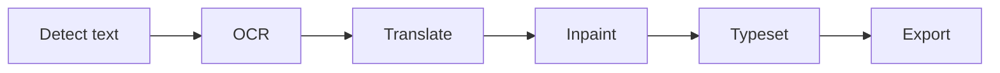

# Lumina — Illuminate every story

Lumina is a free, open-source desktop app for translating manga, manhwa, and manhua. It automates the full pipeline — text detection, OCR, translation, inpainting, and typesetting — while keeping every step editable. All models run locally on ONNX Runtime; translation is the only step that calls external AI APIs.

See the [documentation website](https://lumina.navierr.dev/) for guides and details.


## Table of Contents

- [Features](#features)
- [Showcase](#showcase)
- [How It Works](#how-it-works)
- [Architecture](#architecture)
- [Models](#models)
- [Translation](#translation)
- [GPU Acceleration](#gpu-acceleration)
- [Installers](#installers)
- [Project File Format (.lmi)](#project-file-format-lmi)
- [Development](#development)
- [Roadmap](#roadmap)
- [Changelog](#changelog)
- [License](#license)

## Features

- **Semi-automatic pipeline** — detection, OCR, translation, inpainting, and typesetting are automated, but every step stays editable: detected boxes can be re-ordered or corrected by hand, OCR text can be edited or retranslated per line, and inpaint masks are individual layers you can toggle, move, or remove before export.
- **Content-aware inpainting** with per-bubble masks, plus an automatic full-page mask from segmentation-based detection.
- **Selection tools** — lasso and rectangle with multi-selection refinement: Shift to add or merge, Alt to subtract.
- **Typesetting helpers** — auto-detected text color and slant, auto-fit fonts, per-layer typography.
- Project save/import in a single `.lmi` file, registered as a file association — double-clicking a `.lmi` project opens it directly in Lumina; PNG/JPG export with drag-and-drop reordering.
- **GPU acceleration** with per-model execution provider control.

## Showcase

The following examples may not be frequently updated and may not represent the effect of the current main branch version.

<table>
  <thead>
    <tr>
      <th align="center" width="50%">Original Image</th>
      <th align="center" width="50%">Translated Image</th>
    </tr>
  </thead>
  <tbody>
    <tr>
      <td align="center" width="50%">
        <a href="showcase/1/before.png">
          
        </a>
        <br />
        <a href="https://x.com/rikak/status/1642727617886556160/photo/1">(Source @rikak)</a>
      </td>
      <td align="center" width="50%">
        <a href="showcase/1/after.png">
          
        </a>
        <br />
        <code>full pipeline</code>
      </td>
    </tr>
    <tr>
      <td align="center" width="50%">
        <a href="showcase/2/before.jpg">
          
        </a>
        <br />
        <a href="https://mangadex.org/title/d313c527-5a37-411f-b82b-3ca61feca13e">(Source: MangaDex)</a>
      </td>
      <td align="center" width="50%">
        <a href="showcase/2/after.png">
          
        </a>
        <br />
        <code>full pipeline</code>
      </td>
    </tr>
    <tr>
      <td align="center" width="50%">
        <a href="showcase/3/before.png">
          
        </a>
        <br />
        <a href="https://x.com/hiduki_yayoi/status/1645186427712573440/photo/2">(Source @hiduki_yayoi)</a>
      </td>
      <td align="center" width="50%">
        <a href="showcase/3/cleaned.png">
          
        </a>
        <br />
        <code>inpaint only — no typesetting</code>
      </td>
    </tr>
  </tbody>
</table>

## How It Works



Each step produces editable results: detected boxes can be re-ordered or corrected by hand, OCR text can be edited or retranslated per line, and inpaint masks are individual layers you can toggle, move, or remove before final export.

## Architecture

- **Electron shell** — three layers: `src/main/` (Node process: window, backend lifecycle, file I/O), `src/preload.ts` (context-isolated bridge), `src/renderer/` (UI, canvas, pipeline orchestration).
- **Python backend** — a FastAPI server on `localhost:8765`, spawned and stopped by the Electron main process. All model inference and translation calls go through its HTTP API.
- **ONNX Runtime** — every model runs locally as an ONNX graph; the backend resolves the execution provider at runtime.
- **Single IPC contract** — `src/shared/bridge.ts` defines every channel, payload, and shared type used across processes.

```
lumina/
├── src/
│   ├── main/          Electron main process (window, backend, project, export)
│   ├── preload.ts     Context-isolated IPC bridge
│   ├── renderer/      UI, canvas, pipeline orchestration
│   └── shared/        IPC contract shared with both processes
├── python/
│   ├── main.py        FastAPI entry point
│   ├── services/      Pluggable model registries (detect / ocr / inpaint / translate)
│   └── prompts/       Default translation instructions
├── models/            Model files for local development (see Models section)
└── cache/             Runtime cache (patches, extracted projects)
```

## Models

Models are managed in Settings → Models. They are not bundled with the app; each one is downloaded on demand or placed manually in a models directory.

The models directory is resolved in this order: the `LUMINA_MODEL_DIR` environment variable, the location saved in Settings → Models (via the “Models directory” card), or the platform default `userData/models` (`%APPDATA%\Lumina\models` on Windows). In a source checkout, set `LUMINA_MODEL_DIR` in `.env` (see [.env.example](.env.example)) to keep using the repo's `models/` folder.

| Category | Model          | Status          | Execution                        |
| -------- | -------------- | --------------- | -------------------------------- |
| Detect   | `rtdetr`       | Ready (default) | CUDA / DirectML / CPU            |
| Detect   | `rfdetr_seg`   | Ready           | CUDA / DirectML / CPU            |
| OCR      | `manga_ocr`    | Ready (default) | CUDA / DirectML (decoder on CPU) |
| OCR      | `baberu`       | Ready           | CUDA / DirectML (decoder on CPU) |
| OCR      | `ppocrv6`      | Ready           | CUDA / DirectML / CPU            |
| OCR      | `paddleocr_vl` | In development  | CUDA or CPU (no DirectML)        |
| Inpaint  | `lama_manga`   | Ready (default) | CUDA or CPU (no DirectML)        |
| Inpaint  | `lama`         | Ready           | CPU only                         |
| Aux      | `anglenet`     | Ready (aux)     | CPU (forced)                     |

"Ready" models are stable; "In development" models work but may still have rough edges.

`anglenet` is a tiny global model (~2 MB) that the app auto-downloads in the background on first launch (it also shows up in the model check endpoint, so it can be fetched again manually if needed). It measures the slant of each detected text crop so typesetting can rotate translated text to match the original (`textAngle`); if the file is missing, slant falls back to the PCA heuristic.

## Translation

Translation is the only step that calls an external AI API — everything else (detection, OCR, inpainting, typesetting) runs fully offline. You pick a provider and enter its API key in the translation settings; the key never leaves your machine except as a request header sent directly to the provider you chose.

| Provider   | Compatible with                         | Notes                                                                                                                                            |
| ---------- | --------------------------------------- | ------------------------------------------------------------------------------------------------------------------------------------------------ |
| Custom     | Any OpenAI- or Anthropic-compatible API | Bring your own base URL (Ollama, LM Studio, vLLM, OpenRouter, etc.); an `anthropic` style switch is available for Anthropic-compatible endpoints |
| OpenRouter | OpenRouter                              | Uses your OpenRouter key and model                                                                                                               |
| Groq       | Groq (GroqCloud)                        | Uses your Groq key and model                                                                                                                     |
| Gemini     | Google Gemini                           | Uses your Gemini API key                                                                                                                         |

- **API keys stay local and encrypted.** Keys are stored in Lumina's local secrets vault — encrypted with your operating system's credential facility (DPAPI on Windows, Keychain on macOS, libsecret on Linux) and persisted to `secrets.json` in the app's user-data folder. They are never written to project files (`.lmi`) or sent anywhere except directly to the provider you configured. If the OS encryption facility is unavailable, a fallback (base64 obfuscation) is used rather than failing.
- **Providers load on demand.** The app only imports the SDK for the provider you actually use, so switching between providers (or running local-only models) has no startup cost for the others.

## GPU Acceleration

Lumina uses ONNX Runtime with GPU support where available.

- **One execution provider per environment.** The DirectML and CUDA wheels cannot coexist in a single Python environment. Two installers ship, one per provider: the universal DirectML installer and the NVIDIA-only CUDA installer (see [Installers](#installers)).
- **`LUMINA_EP` environment variable** overrides the runtime preference: `auto` (CUDA → DirectML → CPU, falling back per wheel), `cuda` (CUDA, falling back to CPU — never DirectML), `dml`, or `cpu`.
- **Per-model preferences** are baked into each model's configuration. Some models cannot run on certain providers: `lama` is CPU-only (GPU acceleration is ignored when enabled), `lama_manga` and `paddleocr_vl` never use DirectML (CUDA when available, otherwise CPU), and some OCR models keep their autoregressive decoder on CPU regardless of the chosen provider.

## Installers

Two Windows installers ship, one per execution provider:

- **`Lumina-Setup-DML-<version>.exe`** — DirectML (CPU + DirectML), universal: runs on any DirectX 12 GPU — including NVIDIA — and falls back to CPU on machines without a compatible GPU. Choose this if you don't have an NVIDIA RTX/GTX card.
- **`Lumina-Setup-CUDA-<version>.exe`** — CUDA 12, NVIDIA-only. **Highly recommended over the DML installer if you have an NVIDIA RTX/GTX card** — it's noticeably faster. Requires an NVIDIA GPU with a reasonably recent driver.

Both are published as a release on the [Releases](https://github.com/lumina-tl/lumina/releases) page, together with their update feed files. Each variant uses its own update channel, so a DML install only ever updates from DML artifacts and a CUDA install only from CUDA artifacts. Updates are differential — the app downloads only the parts that changed, not the whole installer — and install on launch, so a one-time install is usually all that's needed. Release notes are taken from the matching `## [<version>]` section in [CHANGELOG.md](CHANGELOG.md); if that section is missing, notes are generated from the commits.

> **CUDA note:** starting with v0.3.0, the CUDA installer no longer bundles the ~1.4 GB ONNX Runtime — the app downloads it once into your user folder on first run (shown in Settings → Models) and verifies it before use. That keeps the installer small and makes every update after this one a small differential download. If you update from an older CUDA version, this first launch downloads the runtime once; later updates won't re-download it. DML installs are unaffected — the runtime is still bundled in that installer.

When running from source, pick the provider wheel yourself: `onnxruntime-directml` for universal GPU support, or `onnxruntime-gpu[cuda,cudnn]` for NVIDIA CUDA (see [Development](#development)), then start the app with `npm start`.

## Project File Format (.lmi)

A `.lmi` file is a zip archive containing a `project.json` manifest plus the page images and inpaint mask patches. The manifest stores the page list, text detections, layers, typography, and a non-secret subset of the translation settings. API keys are never written to the file.

## Development

### Prerequisites

- Node.js (for Electron, esbuild, TypeScript)
- Python 3.13
- A GPU execution provider, if GPU acceleration is wanted:
  - NVIDIA: CUDA-enabled driver plus the `onnxruntime-gpu[cuda,cudnn]` wheel
  - Otherwise: the `onnxruntime-directml` wheel (any GPU) or plain CPU
- Model files placed in the models directory (or downloaded through Settings → Models once the app runs)

### Setup

```sh
# Python backend
python -m venv venv
venv\Scripts\pip install -r python\requirements.txt   # Windows
# source venv/bin/activate && pip install -r python/requirements.txt  # macOS/Linux

# Frontend
npm install
npm run build
npm start
```

The backend is started automatically by the Electron main process; no separate server setup is needed.

## Roadmap

See [TODO.md](TODO.md) for the current list of known issues and planned work.

## Changelog

See [CHANGELOG.md](CHANGELOG.md) for the release history of Lumina.

## License

Lumina is released under the [MIT License](LICENSE). This license covers the source code and the application bundle only.

Model files are **not** included in the distribution and are **not** covered by this license. They are downloaded separately (via the app or manually), and each model carries its own license terms.

The default detector, `rtdetr`, is Apache-2.0 licensed. The segmentation detector `rfdetr_seg` (Koharu Layout RF-DETR Seg 2XL) is trained on the [Manga109](https://manga109.github.io/manga109-project-website/en/) dataset and is restricted to academic, non-commercial research use; it is offered as an optional model for that purpose only.
